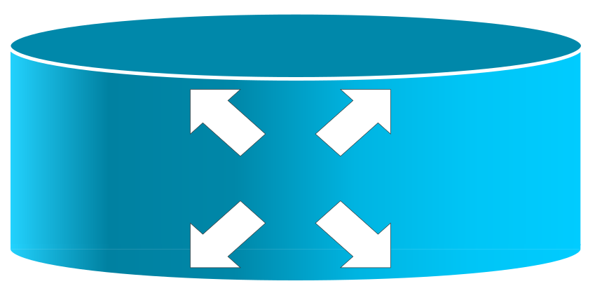

Network Topology Icons
======================

A collection of network topology icons released under the `Creative Commons Attribution-ShareAlike 3.0 license.<https://creativecommons.org/licenses/by-sa/3.0/>`_  I'm not a particularly good graphic designer but it was hard to find a set of icons in SVG format with everything I needed, so I figured I might as well try to create them.

Examples
--------

    Router icon

    Switch icon

    Firewall icon

Specialist Icons
++++++++++++++++

Some icons for specialist equipment I'm working with.

.. figure:: icons/basic/network_tap.svg
    :align: center
    :alt: Network Tap icon
    :figclass: align-center

    Network Tap icon

.. figure:: icons/basic/bypass_switch.svg
    :align: center
    :alt: Bypass Switch icon
    :figclass: align-center

    Bypass Switch icon

Obtaining a copy
----------------
::
    git clone https://github.com/djnrrd/network-topology-icons.git

License
-------

These icons are licensed under the Creative Commons Attribution-ShareAlike 3.0 licenses. You are free to:

* Share — copy and redistribute the material in any medium or format
* Adapt — remix, transform, and build upon the material for any purpose, even commercially.

Under the following terms:

* Attribution — You must give appropriate credit, provide a link to the license, and indicate if changes were made. You may do so in any reasonable manner, but not in any way that suggests the licensor endorses you or your use.

* ShareAlike — If you remix, transform, or build upon the material, you must distribute your contributions under the same license as the original.

* No additional restrictions — You may not apply legal terms or technological measures that legally restrict others from doing anything the license permits.

You do not have to comply with the license for elements of the material in the public domain or where your use is permitted by an applicable exception or limitation.

No warranties are given. The license may not give you all of the permissions necessary for your intended use. For example, other rights such as publicity, privacy, or moral rights may limit how you use the material.
